Compiled from my participation in the [Santa Clara Library 26 in 2026 Reading Challenge](https://SCLIBRARY.ORG/26IN2026). This post gathers one book review for each challenge category.

### 1. [Read a book featuring books](https://sclibrary.bibliocommons.com/v2/list/display/1334494639/2915689317)

**Book:** _The Name of the Rose_ by Umberto Eco 
**Who Recommended It:** myself 
**Rating:** [Your rating]/5

[Add your review here.]

### 2. [Read a Silicon Valley Reads 2026 pick](https://sclibrary.bibliocommons.com/v2/list/display/1348734859/2915698987)

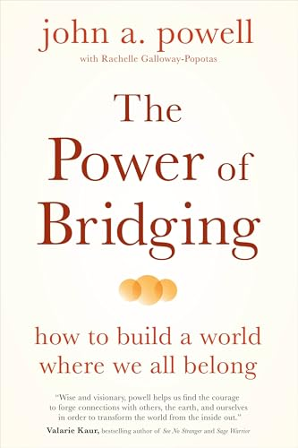

**Book:** _The Power of Bridging_ by John A. Powell 
**Who Recommended It:** Santa Clara Library (pulled from the category URL) 
**Rating:** [Your rating]/5

[Add your review here.]

### 3. Read a book a friend recommended to you

**Book:** _Babel_ by R.F. Kuang 
**Who Recommended It:** Garima 
**Rating:** [Your rating]/5

[Add your review here.]

### 4. [Read a book featuring sports](https://sclibrary.bibliocommons.com/v2/list/display/1334494639/2915757997)

**Book:** _Train Right: Doctor's Orders for Healthy Fitness_ by Ryan Cudahy MD 
**Who Recommended It:** Dr. Cudahy (inadvertently) 
**Rating:** [Your rating]/5

[Add your review here.]

### 5. [Read a book with a number in the title](https://sclibrary.bibliocommons.com/v2/list/display/1334494639/2964662357)

**Book:** _The Forgotten 500_ by Gregory A. Freeman 
**Who Recommended It:** Michelle 
**Rating:** [Your rating]/5

[Add your review here.]

### 6. [Read a book set during a trip or vacation](https://sclibrary.bibliocommons.com/v2/list/display/1334494639/2964674067)

**Book:** _A Time of Gifts_ by Patrick Leigh Fermor 
**Who Recommended It:** myself 
**Rating:** [Your rating]/5

[Add your review here.]

### 7. [Read a book that is a retelling of another story](https://sclibrary.bibliocommons.com/v2/list/display/1334494639/2965305117)

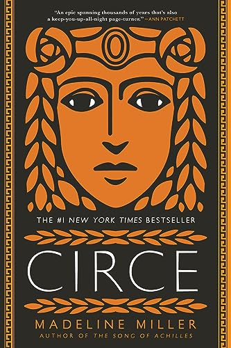

**Book:** _Circe_ by Madeline Miller 
**Who Recommended It:** Pooja, myself 
**Rating:** [Your rating]/5

[Add your review here.]

### 8. [Read a book that was published in the decade you were born](https://sclibrary.bibliocommons.com/v2/list/display/1334494639/2966617795)

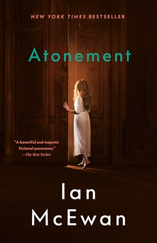

**Book:** Atonement by Ian McEwan 
**Who Recommended It:** Michelles 
**Rating:** [Your rating]/5

[Add your review here.]

### 9. [Read a book written by a Bay Area author](https://sclibrary.bibliocommons.com/v2/list/display/1334494639/2964640097)

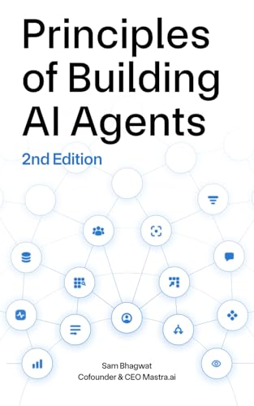

**Book:** Principles of Building AI Agents by Sam Bhagwat 
**Who Recommended It:** myself 
**Rating:** [Your rating]/5

[Add your review here.]

### 10. [Read a graphic novel](https://sclibrary.bibliocommons.com/v2/list/display/1334494639/2976891947)

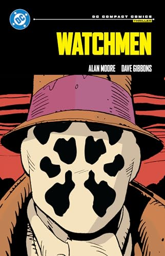

**Book:** _Watchmen_ by Dave Gibbons, Alan Moore 
**Who Recommended It:** my gym trainer 
**Rating:** [Your rating]/5

[Add your review here.]

### 11. [Read a book featuring the great outdoors or nature](https://sclibrary.bibliocommons.com/v2/list/display/1334494639/2976939397)

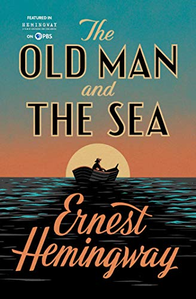

**Book:** _The Old Man and the Sea_ by Ernest Hemingway 
**Who Recommended It:** Michelle 
**Rating:** [Your rating]/5

[Add your review here.]

### 12. Read a book by an author you have never read before

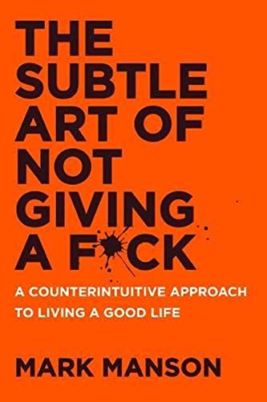

**Book:** _The Subtle Art of Not Giving a F***_ by Mark Manson 
**Who Recommended It:** Fiona 
**Rating:** [Your rating]/5

[Add your review here.]

### 13. [Read a book set more than 100 years ago](https://sclibrary.bibliocommons.com/v2/list/display/1334494639/2977016187)

**Book:** _Crime and Punishment_ by Fyodor Dostoevsky 
**Who Recommended It:** myself 
**Rating:** [Your rating]/5

Shoutout Green Apple Books in SF from where I got this book.

### 14. [Read a memoir or biography](https://sclibrary.bibliocommons.com/v2/list/display/1334494639/2979878127)

**Book:** _Surely You're Joking, Mr. Feynman!_ by Richard Feynman 
**Who Recommended It:** myself 
**Rating:** [Your rating]/5

[Add your review here.]

### 15. Read a book that has been on your TBR for over a year

*TBR means "to be read"; choose a book you've wanted to read for at least a year.*

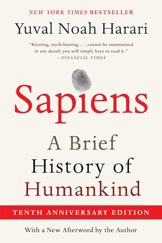

**Book:** _Sapiens_ by Yuval Noah Harari 
**Who Recommended It:** myself 
**Rating:** [Your rating]/5

[Add your review here.]

### 16. [Read a children's book](https://sclibrary.bibliocommons.com/v2/list/display/1334494639/2919209857)

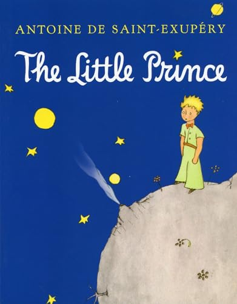

**Book:** _The Little Prince_ by Antoine de Saint-Exupery 
**Who Recommended It:** Kota 
**Rating:** [Your rating]/5

[Add your review here.]

### 17. [Read a book in translation](https://sclibrary.bibliocommons.com/v2/list/display/1334494639/2044347459)

**Book:** _A Long Petal of the Sea_ by Isabel Allende 
**Who Recommended It:** Reanna 
**Rating:** [Your rating]/5

[Add your review here.]

### 18. [Read a book that has been adapted to film or television](https://sclibrary.bibliocommons.com/v2/list/display/1334494639/2980042307)

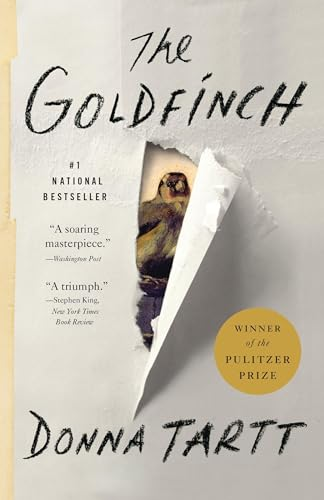

**Book:** _The Goldfinch_ by Donna Tartt 
**Who Recommended It:** Afton 
**Rating:** [Your rating]/5

Fun fact, this book is also from Green Apple Books in SF.

### 19. [Read a book that is a blend of more than one genre](https://sclibrary.bibliocommons.com/v2/list/display/1334494639/2980072157)

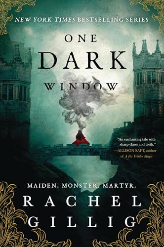

**Book:** _One Dark Window (duology)_ by Rachel Gillig 
**Who Recommended It:** myself 
**Rating:** [Your rating]/5

[[Add your review here.]]

### 20. [Read a book that has been challenged or banned](https://sclibrary.bibliocommons.com/v2/list/display/1334494639/2980124847)

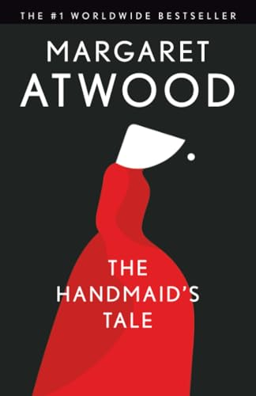

**Book:** _The Handmaid's Tale_ by Margaret Atwood 
**Who Recommended It:** Santa Clara Library (pulled from the category URL) 
**Rating:** [Your rating]/5

[Add your review here.]

### 21. [Read a collection of short stories, essays, or poems](https://sclibrary.bibliocommons.com/v2/list/display/1334494639/2980092607)

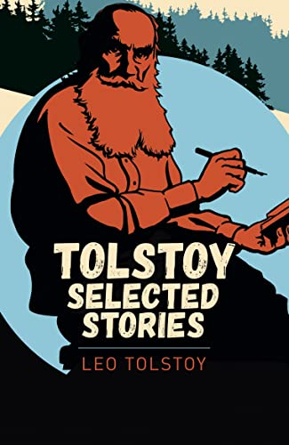

**Book:** _Tolstoy's Short Stories_ by Leo Tolstoy 
**Who Recommended It:** Michelle 
**Rating:** [Your rating]/5

[Add your review here.]

### 22. [Read a book set in a country that is not the U.S. or the U.K. and is written by an author from that country](https://sclibrary.bibliocommons.com/v2/list/display/1334494639/2980141207)

**Book:** _Forest of Enchantments_ by Chitra Banerjee Divakaruni 
**Who Recommended It:** Noopur 
**Rating:** [Your rating]/5

[Add your review here.]

### 23. [Read a book recommended by a celebrity](https://sclibrary.bibliocommons.com/v2/list/display/1334494639/2980159877)

**Book:** _Extreme Ownership_ by Jocko Willink, Leif Babin 
**Who Recommended It:** Marc Andreessen and Leyton 
**Rating:** [Your rating]/5

[Add your review here.]

### 24. [Read a genre fiction book by a BIPOC author](https://sclibrary.bibliocommons.com/v2/list/display/1334494639/2980173747)

*BIPOC means Black, Indigenous, or Person of Color.*

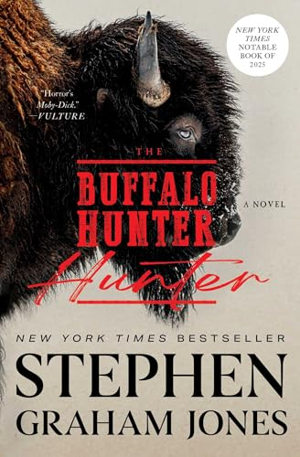

**Book:** _The Buffalo Hunter Hunter_ by Stephen Graham Jones 
**Who Recommended It:** [Source or name] 
**Rating:** [Your rating]/5

[Add your review here.]

### 25. [Read a book under 200 pages](https://sclibrary.bibliocommons.com/v2/list/display/1334494639/2980185327)

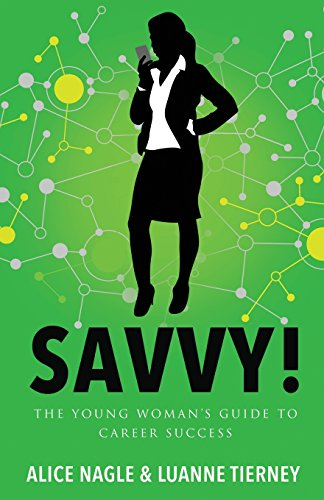

**Book:** _Savvy!_ by Alice Nagle, Luanna Tierney 
**Who Recommended It:** my dad, who knows Alice Nagle 
**Rating:** [Your rating]/5

[Add your review here.]

### 26. Read a book that you already have or own

**Book:** _Chip War_ by Chris Miller 
**Who Recommended It:** my manager at work 
**Rating:** [Your rating]/5

[Add your review here.]

### What I've Read

See [my Goodreads read shelf](https://www.goodreads.com/review/list/98337040?shelf=read) for the full list of what I've read and reviewed.

### Further Acknowledgements

Thank you also to my friends who are not listed here for their recommendations. Those books are on my TBR and will be updated to a future book review post soon.